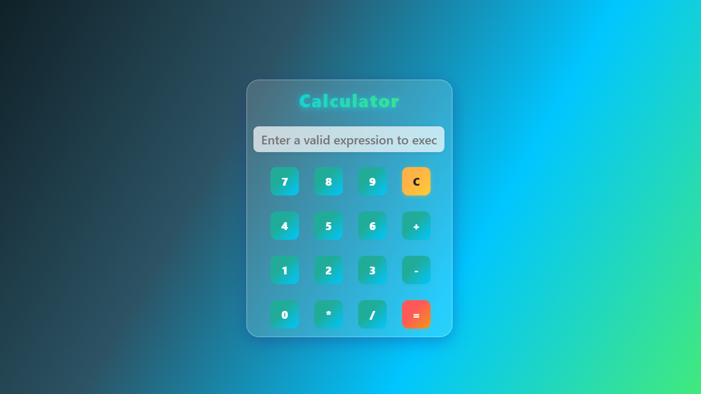

# 🧮 Calculator Project - Sadik Rangrej

A simple and responsive calculator built using **HTML**, **CSS**, and **JavaScript**. This project is ideal for beginners who want to understand how frontend logic and layout work together in a functional UI component.

---

## 📸 Preview

  

---

## 🚀 Live Demo

🔗 [View Live Site](https://sadik-rangrej-calculator.netlify.app/)  

---

## 🧩 Features

- 📱 Fully responsive design  
- ➕ Basic arithmetic operations: Add, Subtract, Multiply, Divide  
- 💡 Clean UI with button hover and active states  
- ⌨️ Keyboard input support (optional)  
- 🔁 Clear and backspace functionality  

---

## 🛠️ Technologies Used

- **HTML5**  
- **CSS3**  
- **JavaScript (Vanilla)**

---

## 📜 License

This project is licensed under the MIT License — see the [LICENSE](LICENSE) file for details.

---

## 👤 Author

**Sadik Rangrej**  
📧 Email: your@email.com  
🌐 Portfolio: [yourdomain.com](https://yourdomain.com)
